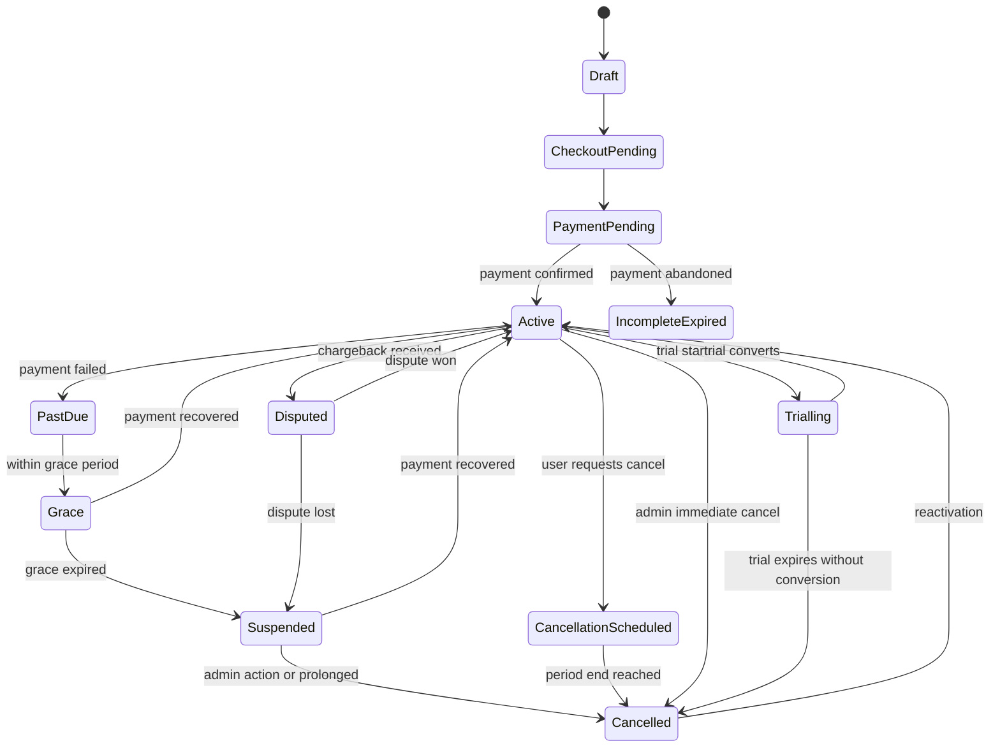
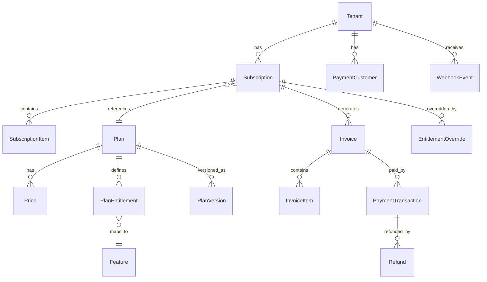

# Subscription Plans, Billing, Payments, Proration, and Entitlement Management — Implementation Plan

> **Document Type**: Technical & Product Implementation Plan
> **Audience**: Product managers, software engineers, QA engineers, finance operations, platform administrators
> **Version**: 1.0
> **Date**: 2026-07-16
> **Status**: Ready for review
> **Reusable**: Yes — this document is brand-neutral and applicable to any multi-tenant SaaS product

---

## 1. Executive Summary

This document defines the complete technical and product specification for introducing subscription plan management, payment processing, automatic entitlement activation, proration, annual billing with a two-months-free offer, upgrade and downgrade workflows, and server-side feature enforcement into an existing multi-tenant SaaS platform.

The recommended architecture separates commercial plans from feature entitlements, uses a dedicated payment provider for secure transaction processing, enforces access on the server rather than relying on UI hiding, and provides platform administrators with full manual override capability alongside automated payment-based activation.

The primary payment provider recommendation is **Paystack** for the African market, with **Stripe Billing** retained as a fallback for international expansion. The annual offer is structured as twelve months of service for the price of ten monthly payments, presented as a two-months-free benefit.

Proration follows a standard model: upgrades charge the prorated difference immediately and activate upon successful payment; downgrades are scheduled to take effect at the end of the current billing period with no mid-cycle refund.

Platform administrators retain the ability to manually assign, change, extend, suspend, or cancel any tenant subscription, with every administrative action recorded in an immutable audit log.

---

## 2. Purpose of the Document

This document serves as:

1. A complete architectural specification for engineering teams
2. A product requirements reference for product managers
3. A testing strategy guide for QA engineers
4. An operational reference for finance and support teams
5. A reusable template applicable to any future SaaS product

It is intentionally brand-neutral. The terms "the application," "the platform," "the system," "the tenant," and "the platform administrator" are used throughout.

---

## 3. Strategic Objectives

1. Enable tenants to self-serve: browse plans, select billing frequency, pay, and gain immediate access
2. Retain administrative control: platform administrators can always override, assign, or correct subscriptions
3. Prevent revenue leakage: entitlements enforced server-side, not just hidden in UI
4. Support annual commitments: twelve months of service for ten monthly payments, presented as two months free
5. Handle plan changes fairly: upgrades prorated with immediate charge, downgrades scheduled to period end
6. Build for auditability: every subscription change, payment event, and administrative action is logged
7. Remain provider-portable: payment provider abstraction allows switching with minimal code changes
8. Support the local market: primary provider supports Nigerian Naira, local cards, bank transfers, and mobile money

---

## 4. Scope

### Included

- Plan creation, editing, duplication, publishing, archiving by platform administrators
- Monthly and annual billing intervals per plan
- Annual offer: twelve months service for ten monthly payments
- Public pricing page with monthly/annual toggle
- Checkout flow via payment provider hosted page
- Automatic plan activation upon verified webhook confirmation
- Prorated upgrades (immediate charge of difference)
- Scheduled downgrades (effective at period end)
- Monthly↔annual billing frequency changes
- Subscription state machine: draft → active → past_due → grace → suspended → cancelled
- Server-side entitlement resolution on every authenticated request
- Manual plan assignment and override by authorized administrators
- Invoice generation, payment receipts, credit notes
- Failed payment retry logic with configurable grace periods
- Refunds, credits, and dispute handling
- Plan versioning with grandfathered pricing for existing subscribers
- Transactional notifications (email and in-app)
- Analytics dashboard: MRR, ARR, churn, conversion, upgrade/downgrade rates
- Existing tenant migration strategy
- Comprehensive testing: unit, integration, webhook, proration, timezone, rounding

### Excluded

- Custom enterprise contract negotiation workflows (manual process)
- Multi-currency dynamic pricing (single base currency with display conversion)
- Affiliate or referral commission tracking
- Marketplace or reseller billing models
- Usage-based metered billing beyond seat counts
- In-app purchase of one-time digital goods

---

## 5. Assumptions

1. The platform operates primarily in Nigeria with Naira (NGN) as the base currency
2. The existing application has a working multi-tenant architecture with tenant isolation
3. Platform administrators have a SuperAdmin role (U001 equivalent) with full access
4. The existing plan-based feature gating system (Starter/Growth/Command) will be extended, not replaced
5. Paystack is available and supports the required payment methods
6. The platform has a Firebase (or equivalent serverless) backend capable of receiving webhooks
7. Tenants are organizations, each with multiple users under one subscription
8. Annual billing means one upfront payment covering twelve months
9. "Two months free" means the tenant pays 10× the monthly rate for 12 months of service
10. Tax treatment (VAT) will be reviewed by a qualified accountant before launch

---

## 6. Research Method

Research was conducted on 2026-07-16 using:

1. Official documentation: Paystack API reference, Stripe Billing documentation, Paddle developer guides, Lemon Squeezy API
2. Provider status pages and pricing pages for current fee structures
3. Industry articles on SaaS pricing, proration, and subscription management
4. Community discussions (Stack Overflow, Reddit r/SaaS, Indie Hackers) on implementation patterns
5. Published case studies on subscription migration and entitlement architecture
6. Firebase documentation on webhook handling, Cloud Functions, and Firestore data modeling

Where provider documentation was unavailable or behind authentication, publicly available summaries and developer guides were used. All pricing and availability data is current as of the research date.

---

## 7. Research Findings

### 7.1 Payment Provider Landscape

| Provider | NGN Support | Recurring | Webhooks | Proration | Hosted Checkout | Fees |
|---|---|---|---|---|---|---|
| **Paystack** | ✅ Native | ✅ | ✅ | Manual calc | ✅ | 1.5% + NGN 100 |
| **Flutterwave** | ✅ Native | ✅ | ✅ | Manual calc | ✅ | 1.4% + NGN 100 |
| **Stripe** | ❌ No NGN | ✅ | ✅ | ✅ Built-in | ✅ | 2.9% + $0.30 |
| **Paddle** | ❌ No NGN | ✅ | ✅ | ✅ Built-in | ✅ | 5% + $0.50 |
| **Lemon Squeezy** | ❌ No NGN | ✅ | ✅ | Limited | ✅ | 5% + $0.50 |
| **Chargebee** | Via gateway | ✅ | ✅ | ✅ Built-in | ✅ | Starts $299/mo |

**Finding**: Paystack is the clear primary choice for Nigerian Naira billing. Stripe should be integrated as a fallback for future international expansion. Flutterwave is a viable alternative if Paystack availability changes.

### 7.2 Proration Best Practices

Industry standard across Stripe, Chargebee, and leading SaaS products:

- **Upgrades**: Charge prorated difference immediately. Activate new plan upon successful payment. If payment fails, keep on current plan.
- **Downgrades**: Schedule to take effect at end of current billing period. Do not refund mid-cycle. Do not charge.
- **Monthly→Annual**: Treat as upgrade. Charge annual amount minus prorated remaining monthly value.
- **Annual→Monthly**: Schedule to take effect at end of annual period. Do not refund.

### 7.3 Pricing Page UX

Research from SaaS pricing page analyses (Price Intelligently, CXL, NNGroup):

- Annual should be the default/primary tab (higher LTV, lower churn)
- Show both monthly equivalent AND total annual price
- Use a toggle, not separate pages
- Display savings prominently: "Save NX,XXX/year (2 months free)"
- Highlight the recommended plan
- Monthly option must be clearly available — never hidden

---

## 8. Recommended Billing Model

**Hybrid model**: Platform administrators control the plan catalog and can manually assign any plan to any tenant. Tenants can self-serve through the pricing page and checkout flow. Payment automatically activates the selected plan and entitlements.

**Primary provider**: Paystack
**Fallback provider**: Stripe (for international tenants when supported)
**Provider abstraction**: A `PaymentProvider` interface with `createCheckout()`, `verifyPayment()`, `handleWebhook()`, `createRefund()` methods allows provider switching.

---

## 9. Subscription Plan Architecture

### 9.1 Plan Structure

A plan is a commercial product definition, separate from its price and from the features it entitles.

```
Plan
├── planId: string (e.g., "plan_growth")
├── name: string (e.g., "Growth")
├── description: string
├── status: 'draft' | 'published' | 'archived'
├── sortOrder: number
├── isRecommended: boolean
├── metadata: Record<string, string>
├── createdAt: timestamp
├── updatedAt: timestamp
└── prices: Price[]          ← one per billing interval
```

### 9.2 Price Structure

```
Price
├── priceId: string
├── planId: string
├── billingInterval: 'monthly' | 'annual'
├── amount: number (in minor currency unit, e.g., kobo)
├── currency: string (e.g., 'NGN')
├── providerPriceId: string | null (Paystack plan code)
├── isActive: boolean
└── createdAt: timestamp
```

### 9.3 Feature Entitlement

```
PlanEntitlement
├── entitlementId: string
├── planId: string
├── featureKey: string (e.g., 'ai_insights', 'codex_repair')
├── isEnabled: boolean
├── quotaLimit: number | null (null = unlimited)
└── metadata: Record<string, string>
```

---

## 10. Pricing Architecture

### 10.1 Monthly Pricing

Each plan has one active monthly price. The amount is stored in the smallest currency unit (kobo for NGN).

Example:
- Starter: NGN 7,500 → 750000 kobo
- Growth: NGN 12,500 → 1250000 kobo
- Command: NGN 15,000 → 1500000 kobo

### 10.2 Annual Pricing (Two Months Free)

Annual price = monthly price × 10 (not × 12).

Example calculations:

| Plan | Monthly | Annual List (12×) | Annual Payable (10×) | Savings | Monthly Equivalent |
|---|---|---|---|---|---|
| Starter | N7,500 | N90,000 | N75,000 | N15,000 (16.7%) | N6,250 |
| Growth | N12,500 | N150,000 | N125,000 | N25,000 (16.7%) | N10,417 |
| Command | N15,000 | N180,000 | N150,000 | N30,000 (16.7%) | N12,500 |

### 10.3 Renewal

Annual subscriptions renew at the same annual payable amount unless the plan price has changed. If the price has increased, existing subscribers may be grandfathered at their current rate depending on the plan versioning policy.

---

## 11. Monthly and Annual Billing

### 11.1 Monthly Cycle

- Billing day: same day of month as subscription start
- If start day is 31st and month has fewer days, bill on last day of month
- Renewal: automatic charge 1 day before period end
- Invoice generated on successful charge

### 11.2 Annual Cycle

- Billing day: same date as subscription start, one year later
- Renewal: automatic charge 3 days before period end
- Renewal reminder sent 14 days and 7 days before renewal
- Invoice generated on successful charge

### 11.3 Billing Frequency Changes

| From | To | When | Proration |
|---|---|---|---|
| Monthly | Annual | Immediately | Charge: annual amount − prorated remaining monthly value |
| Annual | Monthly | At annual period end | No refund. Monthly billing starts after annual period expires |

---

## 12. Two Months Free Annual Offer

### 12.1 Calculation

```
annualPayable = monthlyAmount × 10
annualListValue = monthlyAmount × 12
annualSavings = annualListValue − annualPayable
monthlyEquivalent = annualPayable ÷ 12
savingsPercent = round((annualSavings ÷ annualListValue) × 100, 1)
```

### 12.2 Display Rules

- Show annual total as the primary number
- Show monthly equivalent in smaller text: "That's only NX,XXX/month"
- Show savings badge: "Save NX,XXX/year — that's 2 months free!"
- Never display the annual total as if it were charged monthly
- Invoice must show: "Annual Plan — 12 months service for [annual payable amount]"

---

## 13. Administrative Plan Control

### 13.1 Permissions Matrix

| Action | Platform Owner | Super Admin | Billing Admin | Support | Finance |
|---|---|---|---|---|---|
| Create plan | ✅ | ✅ | ✅ | ❌ | ❌ |
| Edit unpublished plan | ✅ | ✅ | ✅ | ❌ | ❌ |
| Publish plan | ✅ | ✅ | ❌ | ❌ | ❌ |
| Archive plan | ✅ | ✅ | ❌ | ❌ | ❌ |
| Manually assign plan | ✅ | ✅ | ✅ | ❌ | ❌ |
| Change tenant plan | ✅ | ✅ | ✅ | ✅ | ❌ |
| Apply credit/discount | ✅ | ✅ | ✅ | ❌ | ✅ |
| Issue refund | ✅ | ✅ | ❌ | ❌ | ✅ |
| View billing history | ✅ | ✅ | ✅ | ✅ | ✅ |
| Export subscription records | ✅ | ✅ | ✅ | ❌ | ✅ |
| View audit log | ✅ | ✅ | ✅ | ✅ | ✅ |

### 13.2 Manual Plan Assignment

Every manual assignment must record:
- Actor (who performed the action)
- Tenant (which tenant)
- Previous plan
- New plan
- Effective date
- Expiry/renewal date (if applicable)
- Reason (free text)
- Internal note (free text, not visible to tenant)
- Payment status (paid, complimentary, trial, manual_override)
- Audit timestamp

---

## 14. Tenant Subscription Journey

```
View Pricing Page
  → Select Plan
  → Choose Monthly or Annual
  → Click "Get Started" / "Subscribe"
  → Create Account (or login)
  → Create Workspace
  → Enter Billing Details
  → Apply Discount Code (optional)
  → Review Order Summary
  → Accept Terms
  → Click "Pay"
  → Redirected to Provider Checkout
  → Complete Payment
  → Return to Confirmation Page
  → Webhook Received → Plan Activated
  → Access Granted → Welcome Email Sent
```

---

## 15. Checkout and Payment Activation

### 15.1 Critical Rule

**The browser redirect after checkout is NOT sufficient evidence of payment.** The server must verify payment through the provider's API or a signed webhook before activating entitlements.

### 15.2 Activation Flow

```
1. Tenant clicks "Pay" → Server creates Paystack checkout session
2. Tenant completes payment on Paystack's hosted page
3. Paystack redirects tenant to return_url
4. Return page shows "Confirming payment..." with polling
5. Paystack sends charge.success webhook to /api/webhooks/paystack
6. Server verifies webhook signature (HMAC SHA-512)
7. Server checks idempotency (has this event been processed?)
8. Server creates PaymentTransaction record
9. Server creates/updates Subscription record
10. Server assigns plan to tenant workspace
11. Server recalculates entitlements
12. Server sends confirmation email
13. Return page polling detects activation → redirects to dashboard
```

### 15.3 Webhook Processing

- Endpoint: `POST /api/webhooks/paystack`
- Signature verification: HMAC SHA-512 using secret key
- Idempotency: Store event ID, skip if already processed
- Raw payload: Store complete webhook body for audit
- Processing: Queue-based with retry (3 attempts, exponential backoff)
- Dead letter: Failed events stored for manual review
- Reconciliation: Hourly job compares webhook events to provider API

---

## 16. Subscription State Model



| State | Feature Access | Billing | Admin Action Allowed |
|---|---|---|---|
| Draft | No | No | Edit, delete |
| CheckoutPending | No | No | Cancel |
| PaymentPending | No | No | Cancel, manual confirm |
| Trialling | Full (time-limited) | No | Extend, convert, cancel |
| Active | Full | Yes | Upgrade, downgrade, cancel |
| PastDue | Full (grace period) | Retrying | Manual payment, cancel |
| Grace | Full (limited time) | Retrying | Manual payment, suspend |
| Suspended | No | Stopped | Reinstate, cancel |
| CancellationScheduled | Full until expiry | Until expiry | Revoke cancellation, immediate cancel |
| Cancelled | No | Stopped | Reactivate |
| Disputed | Suspended | Frozen | Resolve dispute |
| IncompleteExpired | No | No | Delete |

---

## 17. Entitlement Architecture

### 17.1 Resolution Service

```
resolveEntitlements(tenantId) → EntitlementMap

Inputs considered (in priority order):
1. Active subscription status (must be Active, Trialling, Grace, or CancellationScheduled)
2. Assigned plan from subscription
3. Plan entitlements (features enabled + quota limits)
4. Add-ons purchased
5. Administrative overrides (can grant or revoke individual features)
6. Trial status (may grant temporary access beyond plan)
7. Usage consumed vs quota limits
8. System-level restrictions (global feature flags)

Output: Map<featureKey, { enabled: boolean, quotaLimit: number | null, quotaUsed: number }>
```

### 17.2 Caching Strategy

- Cache entitlements per tenant for 5 minutes
- Invalidate cache on: subscription state change, plan change, payment event, admin override
- Cache key: `entitlements:{tenantId}`
- Never serve stale cache after a downgrade or suspension — use cache-invalidation events

---

## 18. Feature Access Enforcement

Every authenticated API request must pass through entitlement checks. The UI may additionally hide disabled features, but the server is the authoritative enforcer.

```
// Middleware pattern
async function requireFeature(featureKey: string) {
  const entitlements = await resolveEntitlements(req.tenantId)
  if (!entitlements[featureKey]?.enabled) {
    return { error: 'feature_not_available', plan: entitlements.planName }
  }
  // Check quota if applicable
  if (entitlements[featureKey]?.quotaLimit != null &&
      entitlements[featureKey]?.quotaUsed >= entitlements[featureKey]?.quotaLimit) {
    return { error: 'quota_exceeded', limit: entitlements[featureKey].quotaLimit }
  }
  next()
}
```

---

## 19. Data Model

### 19.1 Entity Relationship Diagram



### 19.2 Core Entities

**Tenant** — The subscribing organization workspace.
- `tenantId: string (PK)`
- `name: string`
- `status: 'active' | 'suspended' | 'cancelled'`
- `createdAt: timestamp`

**Plan** — A commercial product definition.
- `planId: string (PK)`
- `name: string`
- `description: string`
- `status: 'draft' | 'published' | 'archived'`
- `sortOrder: number`
- `isRecommended: boolean`
- `createdAt, updatedAt: timestamp`

**Price** — A price point for a plan at a billing interval.
- `priceId: string (PK)`
- `planId: string (FK → Plan)`
- `billingInterval: 'monthly' | 'annual'`
- `amount: number` (minor currency unit)
- `currency: string`
- `providerPriceId: string | null`
- `isActive: boolean`

**Feature** — A named capability in the system.
- `featureKey: string (PK)` (e.g., 'admin_chat', 'smart_task')
- `name: string`
- `description: string`
- `category: string`

**PlanEntitlement** — Maps a feature to a plan.
- `entitlementId: string (PK)`
- `planId: string (FK → Plan)`
- `featureKey: string (FK → Feature)`
- `isEnabled: boolean`
- `quotaLimit: number | null`

**Subscription** — A tenant's active or past subscription.
- `subscriptionId: string (PK)`
- `tenantId: string (FK → Tenant)`
- `planId: string (FK → Plan)`
- `billingInterval: 'monthly' | 'annual'`
- `status: SubscriptionStatus`
- `currentPeriodStart: timestamp`
- `currentPeriodEnd: timestamp`
- `cancelAtPeriodEnd: boolean`
- `cancelledAt: timestamp | null`
- `providerSubscriptionId: string | null`
- `createdAt, updatedAt: timestamp`

**PaymentTransaction** — A record of a payment.
- `transactionId: string (PK)`
- `tenantId: string (FK → Tenant)`
- `invoiceId: string (FK → Invoice)`
- `provider: string`
- `providerTransactionId: string`
- `amount: number`
- `currency: string`
- `status: 'pending' | 'success' | 'failed' | 'refunded'`
- `paymentMethod: string`
- `createdAt: timestamp`

**Invoice** — A bill for a subscription period.
- `invoiceId: string (PK)`
- `tenantId: string (FK → Tenant)`
- `subscriptionId: string (FK → Subscription)`
- `amount: number`
- `currency: string`
- `status: 'draft' | 'open' | 'paid' | 'void' | 'uncollectible'`
- `dueDate: timestamp`
- `paidAt: timestamp | null`
- `invoiceNumber: string` (sequential, e.g., INV-2026-00001)

**WebhookEvent** — Raw webhook storage for audit.
- `eventId: string (PK)`
- `provider: string`
- `providerEventId: string`
- `eventType: string`
- `rawPayload: string`
- `signatureVerified: boolean`
- `processed: boolean`
- `processingError: string | null`
- `receivedAt: timestamp`

**AuditEvent** — Immutable record of administrative actions.
- `auditId: string (PK)`
- `actor: string`
- `action: string`
- `targetType: string` (e.g., 'subscription', 'plan')
- `targetId: string`
- `before: object`
- `after: object`
- `reason: string`
- `createdAt: timestamp`

---

## 20. Plan Versioning

When a published plan's price or features change:

1. Create a new `PlanVersion` record capturing the current state
2. Update the `Plan` record with new values
3. Existing subscriptions continue on the version they subscribed to (grandfathering)
4. New subscriptions get the latest version
5. Administrators can choose to migrate specific tenants to the new version
6. Price increases require tenant notification (30 days for monthly, 60 days for annual)

---

## 21. Proration Policy

### 21.1 Upgrade Proration

**Rule**: Charge the prorated difference immediately. Activate upon successful payment.

**Formula**:
```
remainingDays = daysBetween(now, currentPeriodEnd)
totalDays = daysBetween(currentPeriodStart, currentPeriodEnd)
unusedAmount = (currentPrice / totalDays) × remainingDays
newProratedAmount = (newPrice / totalDays) × remainingDays
chargeAmount = newProratedAmount − unusedAmount
```

If `chargeAmount ≤ 0`, no charge. If payment fails, stay on current plan and notify.

### 21.2 Downgrade Proration

**Rule**: Schedule to take effect at period end. No refund. No immediate charge.

The tenant retains current plan features until the period ends. At period end, the new plan activates at the new rate.

### 21.3 Worked Examples

**Example 1: Monthly Upgrade Halfway Through Month**
- Current: Growth (N12,500/month), 15 days remaining
- New: Command (N15,000/month)
- Unused Growth: (12,500 ÷ 30) × 15 = N6,250
- Prorated Command: (15,000 ÷ 30) × 15 = N7,500
- Charge: N7,500 − N6,250 = N1,250

**Example 2: Monthly to Annual Conversion**
- Current: Growth monthly (N12,500/month), 20 days remaining
- New: Growth annual (N125,000/year)
- Unused monthly: (12,500 ÷ 30) × 20 = N8,333
- Charge: N125,000 − N8,333 = N116,667

**Example 3: Cancellation After Renewal**
- Annual plan renewed at N125,000. Tenant cancels after 10 days.
- Policy: No refund for annual plans after 7-day cooling-off period.
- Access continues until period end. No further charges.

---

## 22. Upgrade Management

1. Tenant views current plan in billing dashboard
2. Tenant selects "Upgrade Plan"
3. System shows available plans above current tier
4. Tenant selects target plan
5. System displays proration preview (amount to charge now)
6. Tenant confirms
7. Payment processed
8. On success: plan upgraded immediately, entitlements recalculated
9. On failure: stays on current plan, error message displayed

---

## 23. Downgrade Management

1. Tenant views current plan in billing dashboard
2. Tenant selects "Change Plan"
3. System shows available plans (including lower tiers)
4. Tenant selects target plan
5. System displays: "Your plan will change to [New Plan] on [Period End Date]. You will not be charged today. Your current features remain available until then."
6. Tenant confirms
7. Subscription updated: `cancelAtPeriodEnd = false`, new plan scheduled
8. At period end: plan changes automatically, new billing cycle starts at new rate

---

## 24. Billing Frequency Changes

| Scenario | Behavior |
|---|---|
| Monthly → Annual (immediate) | Treat as upgrade. Charge annual amount minus prorated remaining monthly value. |
| Annual → Monthly (scheduled) | Schedule to period end. No refund. Monthly billing starts after annual period expires. |
| During trial | Allow. Trial continues. New billing starts after trial. |
| During grace period | Require payment recovery first. |
| With unpaid invoice | Block until invoice paid or waived. |

---

## 25. Cancellation and Reactivation

### 25.1 Cancellation Flow

1. Tenant navigates to Billing → Cancel Subscription
2. System shows: plan name, renewal date, what they'll lose
3. Optional: collect cancellation reason
4. Optional: offer downgrade instead of cancel
5. Tenant confirms cancellation
6. Subscription marked `cancelAtPeriodEnd = true`
7. Access continues until period end
8. At period end: status → `cancelled`, access revoked
9. Confirmation email sent
10. Reactivation available for 30 days post-cancellation

### 25.2 Immediate Cancellation (Admin Only)

Platform administrators can immediately cancel a subscription (e.g., fraud, terms violation). Access revoked instantly.

---

## 26. Trials, Discounts, and Promotions

### 26.1 Free Trials

- Configurable per plan: trial days (0 = no trial)
- During trial: full feature access
- Payment method collected at trial start
- Charge attempted at trial end
- If payment fails → grace period → suspension

### 26.2 Discount Codes

- Coupon entity: code, discount type (percentage/fixed), amount, max uses, expiry
- Applied at checkout
- One coupon per subscription
- Coupon applied to first billing period only (or recurring if configured)
- Stored on subscription for invoice accuracy

---

## 27. Failed Payments and Recovery

### 27.1 Retry Schedule

| Attempt | When | Action |
|---|---|---|
| 1st | Due date | Charge attempt |
| 2nd | +3 days | Retry |
| 3rd | +5 days | Retry |
| 4th | +7 days | Retry + email notification |

### 27.2 Grace Period

- Default: 7 days after first failed payment
- Configurable per plan
- During grace: full feature access, "Update Payment Method" banner
- After grace: subscription suspended, access revoked

---

## 28. Refunds, Credits, and Disputes

- **Refunds**: Processed through payment provider. Admin-initiated only. Full or partial.
- **Credits**: Account credit applied to next invoice. Admin-initiated.
- **Disputes/Chargebacks**: Subscription immediately suspended. Admin reviews. If won, reinstated. If lost, cancelled.

---

## 29. Payment Provider Evaluation

### Recommendation

**Primary: Paystack** — Native NGN support, local cards, bank transfer, mobile money, hosted checkout, webhooks, 1.5% + NGN 100 fee.

**Fallback: Stripe** — For future international expansion. No NGN support currently. Best-in-class billing features (built-in proration, invoice management, tax).

### Provider Abstraction

```typescript
interface PaymentProvider {
  createCheckoutSession(params: CheckoutParams): Promise<CheckoutSession>
  verifyPayment(reference: string): Promise<PaymentVerification>
  verifyWebhookSignature(payload: string, signature: string): boolean
  createRefund(transactionId: string, amount?: number): Promise<Refund>
  getSubscription(providerSubscriptionId: string): Promise<ProviderSubscription>
}
```

---

## 30. Local and International Payment Methods

### Supported via Paystack

- Debit/credit cards (Visa, Mastercard, Verve)
- Bank transfer (virtual account generation)
- Bank direct (USSD)
- Mobile money
- QR code payments
- POS terminal (in-person, if applicable)

### Recurring Support

- Cards: ✅ (tokenized, auto-charge)
- Bank transfer: ❌ (manual reconciliation required)
- USSD: ❌ (one-time)
- Mobile money: ✅ (with provider-specific setup)

---

## 31. Tax, Invoicing, and Accounting Considerations

> **Disclaimer**: This section identifies areas requiring professional review. It does not constitute legal, tax, or accounting advice.

- Nigerian VAT (7.5%): Apply to taxable supplies if annual turnover exceeds NGN 25 million
- Tax-inclusive pricing recommended for B2C; tax-exclusive for B2B with valid TIN
- Invoice numbering: sequential, non-editable (INV-YYYY-NNNNN)
- Annual prepayments: recognize revenue monthly over 12 months (deferred revenue)
- Record retention: 7 years (Nigerian FIRS requirement)
- Export: CSV/PDF for accounting system import

---

## 32. Security and Fraud Prevention

1. Webhook signature verification (HMAC SHA-512) on every event
2. Idempotency keys prevent duplicate processing
3. Server-side entitlement enforcement (never trust client)
4. No card data stored on platform servers (provider handles PCI compliance)
5. Rate limiting on checkout and webhook endpoints
6. Suspicious activity monitoring: rapid plan switches, multiple failed payments
7. Admin actions require MFA (recommended, not enforced by code)
8. Audit log immutability: append-only, no delete
9. Secrets (API keys) stored in environment variables, never in code
10. Test mode: separate API keys for sandbox vs production

---

## 33. Webhook and Event Processing

```
POST /api/webhooks/paystack
  → Verify HMAC signature
  → Check idempotency (event ID already processed?)
  → Store raw payload
  → Route to handler by event type
  → Process (create/update subscription, invoice, payment)
  → Mark as processed
  → Return 200 OK

Failures:
  → Retry 3× with exponential backoff
  → Dead letter queue for manual review
  → Alert if dead letter queue exceeds 10 events
```

---

## 34. Application Programming Interface Design

| Method | Path | Auth | Purpose |
|---|---|---|---|
| GET | /api/plans | Public | List published plans with prices |
| GET | /api/plans/:id | Public | Get plan details |
| POST | /api/checkout | Tenant | Create checkout session |
| GET | /api/checkout/:sessionId | Tenant | Poll checkout status |
| GET | /api/subscription | Tenant | View current subscription |
| POST | /api/subscription/preview-upgrade | Tenant | Preview upgrade proration |
| POST | /api/subscription/upgrade | Tenant | Execute upgrade |
| POST | /api/subscription/schedule-downgrade | Tenant | Schedule downgrade |
| POST | /api/subscription/cancel | Tenant | Cancel subscription |
| POST | /api/subscription/reactivate | Tenant | Reactivate cancelled |
| GET | /api/invoices | Tenant | List invoices |
| GET | /api/invoices/:id | Tenant | Download invoice |
| GET | /api/entitlements | Tenant | View current entitlements |
| POST | /api/admin/plans | Admin | Create plan |
| PUT | /api/admin/plans/:id | Admin | Update plan |
| POST | /api/admin/subscriptions/assign | Admin | Manually assign plan |
| POST | /api/admin/subscriptions/adjust | Admin | Adjust subscription |
| GET | /api/admin/subscriptions | Admin | List all subscriptions |
| POST | /api/webhooks/paystack | System | Receive Paystack webhooks |

---

## 35. User Interface and User Experience

### 35.1 Required Interfaces

1. **Public Pricing Page** — Plan cards, monthly/annual toggle, CTA buttons
2. **Checkout Page** — Redirect to provider-hosted checkout
3. **Payment Confirmation** — Polling spinner → success/failure
4. **Tenant Billing Dashboard** — Current plan, renewal date, usage, invoices, payment method
5. **Upgrade Modal** — Plan comparison, proration preview, confirm button
6. **Downgrade Modal** — Scheduled change notice, confirm button
7. **Cancel Flow** — Reason collection, retention offer, confirmation
8. **Admin Plan Manager** — CRUD table, publish/archive actions, feature assignment
9. **Admin Subscription Manager** — Search tenants, view/edit subscriptions, manual assign
10. **Webhook Monitor** — Event log, retry button, error details

### 35.2 Loading, Empty, Error States

Every interface must handle:
- **Loading**: Skeleton or spinner
- **Empty**: Informative message (e.g., "No invoices yet")
- **Error**: Specific error message with retry action
- **Success**: Confirmation message with next steps

---

## 36. Pricing Page Design

```
┌──────────────────────────────────────────────────────────────┐
│                     [Monthly ◉  ○ Annual]                    │
│                                                              │
│  ┌──────────┐  ┌──────────────┐  ┌──────────────┐          │
│  │ Starter  │  │  Growth  ⭐  │  │  Command     │          │
│  │          │  │ RECOMMENDED  │  │              │          │
│  │ N7,500   │  │  N12,500     │  │  N15,000     │          │
│  │ /month   │  │  /month      │  │  /month      │          │
│  │          │  │              │  │              │          │
│  │ Basic    │  │ Core AI +    │  │ All AI +     │          │
│  │ features │  │ Analytics    │  │ Codex Repair │          │
│  │          │  │              │  │              │          │
│  │ [Start]  │  │ [Subscribe]  │  │ [Subscribe]  │          │
│  └──────────┘  └──────────────┘  └──────────────┘          │
│                                                              │
│  Annual pricing selected:                                    │
│  ┌──────────┐  ┌──────────────┐  ┌──────────────┐          │
│  │ Starter  │  │  Growth  ⭐  │  │  Command     │          │
│  │          │  │              │  │              │          │
│  │ N75,000  │  │  N125,000    │  │  N150,000    │          │
│  │ /year    │  │  /year       │  │  /year       │          │
│  │          │  │              │  │              │          │
│  │ N6,250/  │  │  N10,417/    │  │  N12,500/    │          │
│  │ month eq │  │  month eq    │  │  month eq    │          │
│  │          │  │              │  │              │          │
│  │ SAVE     │  │  SAVE        │  │  SAVE        │          │
│  │ N15,000  │  │  N25,000     │  │  N30,000     │          │
│  │ 2 MONTHS │  │  2 MONTHS    │  │  2 MONTHS    │          │
│  │ FREE!    │  │  FREE!       │  │  FREE!       │          │
│  │          │  │              │  │              │          │
│  │ [Start]  │  │ [Subscribe]  │  │ [Subscribe]  │          │
│  └──────────┘  └──────────────┘  └──────────────┘          │
└──────────────────────────────────────────────────────────────┘
```

Key rules:
- Annual tab is default (selected on page load)
- Monthly equivalent shown in smaller text below annual total
- Savings displayed prominently with "2 MONTHS FREE!" badge
- Toggle is clear, accessible, and works without JavaScript (graceful degradation)
- Recommended plan highlighted visually (border, badge, or background)

---

## 37. Accessibility

All subscription interfaces must meet WCAG 2.2 Level AA:

- Pricing toggle: operable by keyboard, screen-reader announces selected state
- Plan cards: proper heading hierarchy, no information conveyed by color alone
- Forms: labels associated with inputs, error messages linked via aria-describedby
- Checkout: provider-hosted page should be assessed for accessibility
- Modals: focus trapped, ESC to close, ARIA dialog role
- Color contrast: text 4.5:1 minimum, large text 3:1 minimum
- Touch targets: minimum 44×44px for interactive elements
- Reduced motion: respect prefers-reduced-motion for transitions

---

## 38. Responsive Behaviour

- Mobile (< 640px): Single column plan cards, stacked toggle
- Tablet (640-1024px): Two column where space allows
- Desktop (> 1024px): Full three-column plan comparison
- Pricing cards stack vertically on narrow screens
- Toggle remains usable at all widths
- Checkout redirect handled gracefully on mobile

---

## 39. Notifications

### Transactional Emails

| Event | Recipient | Timing |
|---|---|---|
| Trial started | Tenant billing contact | Immediately |
| Trial ending (3 days) | Tenant billing contact | 3 days before |
| Payment successful | Tenant billing contact | Immediately |
| Payment failed | Tenant billing contact | Immediately, then per retry schedule |
| Subscription activated | Tenant billing contact | Immediately |
| Plan upgraded | Tenant billing contact | Immediately |
| Downgrade scheduled | Tenant billing contact | Immediately |
| Renewal approaching (annual: 14d, 7d) | Tenant billing contact | 14 and 7 days before |
| Subscription renewed | Tenant billing contact | Immediately |
| Cancellation confirmed | Tenant billing contact | Immediately |
| Refund issued | Tenant billing contact | Immediately |
| Admin plan assigned | Tenant billing contact | Immediately |
| Invoice available | Tenant billing contact | Immediately |

### In-App Notifications

- Payment method update reminder during grace period
- Upgrade available banner (if on lower plan)
- "Your plan changes on [date]" for scheduled downgrades

---

## 40. Analytics and Reporting

### Key Metrics

| Metric | Formula | Dashboard |
|---|---|---|
| MRR | Sum of monthly subscriptions + (annual/12) | Finance |
| ARR | MRR × 12 | Finance |
| ARPU | MRR ÷ active tenants | Finance |
| Trial conversion rate | Converted trials ÷ completed trials | Product |
| Monthly plan adoption | % of tenants on each plan | Product |
| Annual plan adoption | % of tenants on annual billing | Product |
| Upgrade rate | Upgrades ÷ active subscriptions (monthly) | Product |
| Downgrade rate | Downgrades ÷ active subscriptions (monthly) | Product |
| Churn rate | Cancelled ÷ active subscriptions (monthly) | Finance |
| Failed payment rate | Failed payments ÷ total charges | Engineering |
| Recovery rate | Recovered payments ÷ failed payments | Engineering |
| Checkout abandonment | Abandoned checkouts ÷ initiated checkouts | Product |

---

## 41. Existing Tenant Migration

### Migration Strategy

1. **Audit existing tenants**: Identify current plan assignments, feature usage, and payment status
2. **Create default subscriptions**: Every active tenant gets a Subscription record with status 'active', plan matching current assignment, and `providerSubscriptionId = null`
3. **Internal/test tenants**: Marked as `payment_status = 'manual_override'`, exempt from payment requirements
4. **Communication**: Email all tenant admins 14 days before migration explaining the new billing system
5. **Grace period**: 30 days where existing tenants are not required to enter payment details
6. **Payment collection**: After grace period, prompt tenants to add payment method on next login
7. **No forced downgrade**: Existing tenants keep current plan until they choose to change or payment becomes required per business policy

---

## 42. Testing Strategy

### 42.1 Test Categories

| Category | Scope | Tools |
|---|---|---|
| Unit | Entitlement resolution, proration calculation, state transitions | Jest/Vitest |
| Integration | API endpoints, webhook processing, provider abstraction | Supertest |
| Contract | Provider API compatibility | Pact or manual |
| Webhook | Signature verification, idempotency, event ordering | Mock server |
| E2E | Full checkout → activation → upgrade → downgrade → cancel | Playwright |
| Proration | All 10 worked examples from Section 21 | Unit + E2E |
| Timezone | Billing across UTC, WAT, GMT+1 boundaries | Unit |
| Leap year | Feb 29 billing, annual renewal edge cases | Unit |
| Rounding | Kobo precision, division remainders | Unit |
| Accessibility | WCAG 2.2 AA audit on pricing, checkout, billing pages | axe-core |
| Security | Webhook forgery, replay attacks, IDOR on subscriptions | Manual + automated |
| Migration | Existing tenant → subscription record creation | Integration |
| Load | 1000 concurrent checkout sessions, webhook processing | k6/Artillery |

### 42.2 Proration Test Cases

| # | Scenario | Expected |
|---|---|---|
| 1 | Monthly upgrade day 15 of 30 | Charge N1,250 (see Example 1) |
| 2 | Monthly downgrade day 15 of 30 | No charge, scheduled to period end |
| 3 | Monthly→Annual with 20 days remaining | Charge N116,667 (see Example 2) |
| 4 | Annual→Monthly | No refund, scheduled to period end |
| 5 | Upgrade with unpaid invoice | Blocked until invoice resolved |
| 6 | Upgrade where payment fails | Stay on current plan |
| 7 | Feb 29 start date, monthly renewal | Bills on Feb 28 in non-leap years |
| 8 | Annual renewal on Dec 31 | Correct next-year date |
| 9 | Rounding: 12500/30 = 416.666... | Round to nearest kobo (417) |
| 10 | Zero charge upgrade (downgrade + upgrade same price) | No payment, immediate switch |

---

## 43. Deployment Strategy

1. **Development**: Local + Paystack test mode
2. **Staging**: Deployed to staging environment, Paystack test mode, test cards
3. **Production**: Paystack live mode, real payments
4. **Feature flags**: Subscription system behind feature flag, enabled for internal testers first
5. **Database migration**: Non-destructive — add tables, do not drop existing columns
6. **Rollback plan**: Feature flag off, new tables retained, no data loss
7. **Webhook registration**: Register production webhook URL in Paystack dashboard

---

## 44. Monitoring and Operations

### Alerts

| Condition | Severity | Channel |
|---|---|---|
| Webhook signature verification failure | Critical | On-call |
| Dead letter queue > 10 events | Critical | On-call |
| Payment provider outage detected | Critical | On-call |
| Failed payment rate > 20% | Warning | Engineering Slack |
| Subscription reconciliation mismatch | Warning | Finance Slack |
| Provisioning delay > 60 seconds | Warning | Engineering Slack |

### Daily Checks

- Verify webhook processing health (no backed-up events)
- Check dead letter queue
- Reconcile daily payment totals against provider dashboard
- Monitor new subscriptions and cancellations

---

## 45. Risk Register

| # | Risk | Likelihood | Impact | Mitigation |
|---|---|---|---|---|
| 1 | Payment provider downtime | Medium | Critical | Fallback provider, cached entitlements |
| 2 | Webhook delivery delay | Medium | High | Reconciliation job, polling fallback |
| 3 | Proration calculation error | Low | High | Comprehensive test suite, admin correction UI |
| 4 | Double-charging tenant | Low | Critical | Idempotency keys, transaction deduplication |
| 5 | Entitlement not revoked after cancellation | Low | Critical | Server-side enforcement, cache invalidation |
| 6 | Existing tenant migration errors | Medium | Medium | Dry-run migration, rollback plan |
| 7 | Currency rounding discrepancies | Low | Low | Standardize on kobo, round consistently |
| 8 | Admin abuse (unauthorized plan assignment) | Low | High | Role-based permissions, audit log, MFA |
| 9 | Tax compliance error | Medium | High | Accountant review before launch |
| 10 | Provider API version deprecation | Low | Medium | Provider abstraction layer, version monitoring |

---

## 46. Decision Register

| # | Decision | Options Considered | Rationale |
|---|---|---|---|
| 1 | Primary payment provider | Paystack, Flutterwave, Stripe | Paystack: native NGN, lowest fees, reliable webhooks |
| 2 | Upgrade proration | Immediate charge vs next invoice | Immediate charge: clear, industry standard, prevents abuse |
| 3 | Downgrade timing | Immediate vs period end | Period end: fair to tenant, no refund complexity |
| 4 | Proration engine | Self-built vs provider-managed | Self-built: provider-agnostic, full control, testable |
| 5 | Annual default on pricing page | Annual vs monthly | Annual: higher LTV, lower churn, industry best practice |
| 6 | Grandfathering existing tenants | Yes vs force-migrate | Yes: preserves trust, allows gradual transition |
| 7 | Entitlement cache TTL | 1 min, 5 min, 15 min | 5 min: balances freshness with performance |

---

## 47. Implementation Work Breakdown

| ID | Workstream | Task | Owner | Priority | Complexity |
|---|---|---|---|---|---|
| W01 | Data | Create Plan, Price, Feature, PlanEntitlement entities | Backend | P0 | Medium |
| W02 | Data | Create Subscription, Invoice, PaymentTransaction entities | Backend | P0 | Medium |
| W03 | Data | Create WebhookEvent, AuditEvent, EntitlementOverride entities | Backend | P0 | Low |
| W04 | Data | Database migration scripts | Backend | P0 | Medium |
| W05 | Provider | Paystack integration: checkout session creation | Backend | P0 | High |
| W06 | Provider | Paystack integration: webhook handler | Backend | P0 | High |
| W07 | Provider | Paystack integration: refund, verification | Backend | P1 | Medium |
| W08 | Provider | PaymentProvider abstraction interface | Backend | P0 | Medium |
| W09 | Core | Subscription state machine | Backend | P0 | High |
| W10 | Core | Entitlement resolution service | Backend | P0 | High |
| W11 | Core | Proration calculation engine | Backend | P0 | High |
| W12 | Core | Feature enforcement middleware | Backend | P0 | Medium |
| W13 | Core | Invoice generation | Backend | P1 | Medium |
| W14 | Core | Failed payment retry scheduler | Backend | P1 | Medium |
| W15 | Core | Monthly counter reset (existing AI counters) | Backend | P1 | Low |
| W16 | Admin | Plan CRUD UI | Frontend | P0 | Medium |
| W17 | Admin | Manual plan assignment UI | Frontend | P0 | Medium |
| W18 | Admin | Subscription management UI | Frontend | P1 | Medium |
| W19 | Admin | Webhook monitor UI | Frontend | P2 | Low |
| W20 | Tenant | Pricing page with monthly/annual toggle | Frontend | P0 | High |
| W21 | Tenant | Checkout flow (redirect + confirmation) | Frontend | P0 | High |
| W22 | Tenant | Billing dashboard | Frontend | P1 | High |
| W23 | Tenant | Upgrade/downgrade modals | Frontend | P1 | Medium |
| W24 | Tenant | Invoice history | Frontend | P2 | Low |
| W25 | Tenant | Cancel/reactivate flow | Frontend | P1 | Medium |
| W26 | Notifications | Transactional email templates | Full-stack | P1 | Medium |
| W27 | Notifications | In-app notification integration | Frontend | P2 | Low |
| W28 | Analytics | MRR/ARR/churn dashboard | Full-stack | P2 | Medium |
| W29 | Migration | Existing tenant audit + subscription backfill | Backend | P0 | High |
| W30 | Testing | Unit tests (entitlements, proration, states) | QA | P0 | High |
| W31 | Testing | Integration tests (API endpoints) | QA | P0 | High |
| W32 | Testing | Webhook tests (signature, idempotency) | QA | P0 | High |
| W33 | Testing | E2E tests (checkout → activation) | QA | P1 | High |
| W34 | Testing | Proration scenario tests | QA | P1 | Medium |
| W35 | Testing | Accessibility audit | QA | P2 | Medium |
| W36 | Deployment | Staging environment configuration | DevOps | P0 | Medium |
| W37 | Deployment | Production webhook registration | DevOps | P0 | Low |
| W38 | Deployment | Feature flag configuration | DevOps | P0 | Low |
| W39 | Docs | API documentation | Backend | P2 | Low |
| W40 | Docs | Admin user guide | Product | P2 | Low |

---

## 48. Acceptance Criteria

1. Platform administrator can create, edit, publish, and archive plans
2. Platform administrator can manually assign any plan to any tenant
3. Tenant can view pricing page and toggle between monthly and annual display
4. Annual pricing shows twelve months of service for ten monthly payments
5. Tenant can complete checkout via payment provider and receive immediate access
6. Payment activation depends on verified webhook, not browser redirect
7. Features are enforced on the server, not only hidden in the UI
8. Plan upgrade charges prorated difference and activates immediately on payment
9. Plan downgrade is scheduled to period end with no mid-cycle refund
10. Failed payments trigger retry schedule, grace period, and suspension
11. Platform administrator can issue refunds, credits, and manual overrides
12. All administrative actions are recorded in an immutable audit log
13. Transactional emails are sent for all key subscription events
14. Existing tenants are migrated without data loss or forced payment
15. All proration scenarios produce correct calculations within ±1 kobo
16. Webhook idempotency prevents duplicate processing
17. Entitlement cache is invalidated on subscription state change
18. Pricing page meets WCAG 2.2 AA accessibility standards
19. System handles leap years, month-length variations, and timezone differences
20. All 40 work breakdown items have defined ownership and acceptance criteria

---

## 49. Final Recommendation

1. **Build, don't just integrate**: Implement the subscription engine in-house (state machine, entitlements, proration) while delegating only payment processing to the provider. This keeps the platform provider-agnostic and fully testable.

2. **Use Paystack as primary provider** for the Nigerian market with Stripe retained as a fallback for future international expansion. The `PaymentProvider` abstraction makes switching feasible.

3. **Enforce entitlements server-side**: The UI can hide disabled features, but the server middleware must be the authoritative gate. Never trust the client to enforce plan-based access.

4. **Default to annual billing** on the pricing page with clear monthly equivalent display. Two months free is economically equivalent to a 16.7% discount — communicate it as "2 months free" for maximum consumer clarity.

5. **Charge upgrades immediately**: Prorated difference charged at time of upgrade; access granted upon successful payment. This prevents abuse and aligns with industry standard.

6. **Schedule downgrades to period end**: No mid-cycle refunds. Tenant retains current features until the period ends, then the new plan takes effect.

7. **Version plans, grandfather tenants**: When pricing changes, existing subscribers stay on their current rate. New subscribers get the new rate. This preserves trust and avoids forced migration complexity.

8. **Test proration exhaustively**: The 10 test scenarios in Section 42.2 are the minimum. Add edge cases as they arise. Proration bugs are revenue-affecting and trust-eroding.

9. **Review with professionals before launch**: Tax treatment (VAT), terms of service, privacy policy, refund policy, and data retention must be reviewed by a qualified accountant and lawyer familiar with Nigerian e-commerce regulations.

10. **Document everything**: This document serves as the specification. Every deviation during implementation must be recorded with rationale.

---

## 50. Sources and References

1. Paystack API Documentation — https://paystack.com/docs/api/
2. Stripe Billing Documentation — https://stripe.com/docs/billing
3. Firebase Cloud Functions — https://firebase.google.com/docs/functions
4. WCAG 2.2 — https://www.w3.org/TR/WCAG22/
5. SaaS Pricing Page Best Practices — CXL Institute, Price Intelligently
6. Proration in Subscription Billing — Stripe Billing documentation, Chargebee documentation
7. Nigerian VAT Act (as amended) — Federal Inland Revenue Service
8. Firebase Firestore Data Modeling — https://firebase.google.com/docs/firestore/data-model
9. Webhook Best Practices — Stripe webhook documentation, Paystack webhook documentation
10. Subscription State Machines — Stripe subscription lifecycle, Chargebee subscription states

---

*Document version 1.0. Last updated 2026-07-16. Reusable across any multi-tenant SaaS product.*
